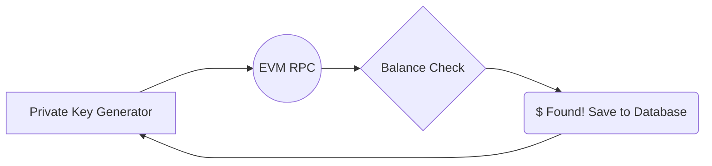
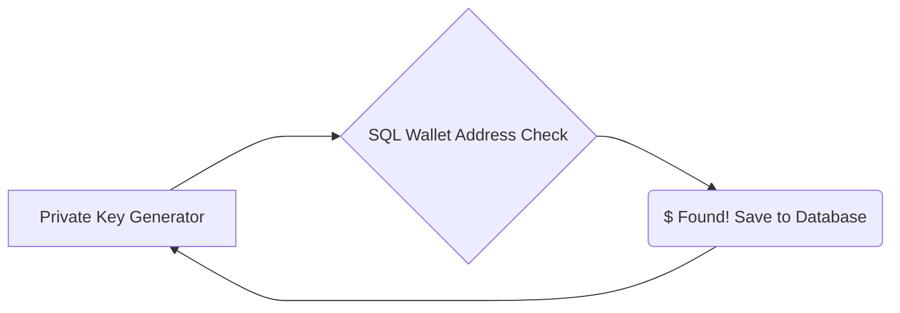

<h2 align="left">  PrivateMiner Open Source Blockchain Private Key Explorer for EVM Networks</h2>

In EVM networks (<strong>Ethereum</strong>, <strong>Binance Smart Chain</strong>, <strong>Polygon</strong>, <strong>Avax</strong>, <strong>Arbitrum</strong>, <strong>Fantom</strong>, <strong>Cronos</strong>, <strong>Optimism</strong>, <strong>Gnosis</strong>) I will talk about 2 different ways to scan for active or unused wallets;

<strong>Ethereum</strong>, <strong>Binance Smart Chain</strong>, <strong>Polygon</strong>, <strong>Avax</strong>, <strong>Arbitrum</strong>, <strong>Phantom</strong>, <strong>Cronos</strong>, <strong>Optimism</strong>, <strong>Gnosis</strong> Since the private key encryption of these EVM networks is the same, we will scan them all at the same time, thus increasing our chances of finding the existing private key.

It may seem confusing to you before we start, but I will try to explain it for you in the simplest way with examples, tests and hardware knowledge.

<h2>
</h2><ul>

<strong> Querying the balances of Private Keys Generated with RPC</strong>

<strong> Saving current wallet addresses in home networks to our local machine and querying as database without RPC (Fastest method)</strong>

<h2>
</ul>

<blockquote>

<strong>Ethereum</strong> DATABASE DUMPS -- 221M-Address — 200$ 
<strong>BSC</strong> DATABASE DUMPS -- 245M-Address — 200$ 
<strong>Polygon</strong> DATABASE DUMPS -- 215M-Address — 150$ 
<strong>Avax</strong> DATABASE DUMPS -- 5M-Address — 50$ 
<strong>Arbitrum</strong> DATABASE DUMPS -- 2.7M-Address — 50$ 
<strong>Fantom</strong> DATABASE DUMPS -- 51M-Address — 100$ 
<strong>Cronos</strong> DATABASE DUMPS -- 1.1M-Address — 50$ 
<strong>Optimism</strong> DATABASE DUMPS -- 2.7M-Address — 50$ 
<strong>Gnosis</strong> DATABASE DUMPS -- 5M-Address — 50$

</blockquote>

The database shooting process is a very laborious and tedious process. It takes almost years to scan the blocks in EVM networks with RPC, but you can easily reach them all. Unfortunately, this data is not sold on the Internet, it can be said that it is impossible to find.

<h2 id="how-does-this-work">How does this work?</h2>

A private key is basically just a number between 1 and 2256. This website generates keys for all of those numbers, spread out over pages of 128 keys each.

This website doesn’t actually have a database of all private keys, that would take an impossible amount of disk space. Instead, keys are procedurally generated on the fly when a page is opened. The page number is used to calculate which keys should be on that page.

Finding an active wallet is difficult but not impossible. When we generate a random private key, you have a chance to find someone else’s fortune.

<h2 align="left">Querying Private Keys created with RPC</h2>

Querying with RPC is a bit slow system, RPC’s request restrictions per current second, hangups (RPC crashes) occur because we send too many queries. 
Although all the RPC links I tried on <a href="http://chainlist.org">chainlist.org</a> were successful, controlling many networks at the same time reduces our chance of finding private keys. Because it is necessary to query the created Private Key with different RPCs in 9 networks, which makes it impossible, so if we are going to continue with RPC, we have to choose 1 EVM network and try our luck in this network.

When the balance query is made, if there is any txns record or balance in the account, the database automatically records it.

<h2 id="supported-platforms">Supported Platforms</h2>

On <strong>Linux</strong> and <strong>Windows</strong> EVM networks support private key generation.

<h2 id="recommended-requirements">Recommended Requirements</h2>
<ul>
<li>Server running the latest versions of Linux or Windows.</li>
<li>10 core CPU and 16 GB memory (RAM)</li>
<li>Broadband internet connection with 50MB/s upload/download speeds</li>
</ul>
<h2>
## Registering the current wallet addresses in the home networks to our local machine and querying as a database without RPC
</h2>
As the fastest method we discovered, without RPC query, the query speed is incredibly fast and trouble-free through the database we created, but it has a disadvantage, if the accounts with balance in the newly created blocks are not in the existing database, it means we will never be able to access them, but don’t worry, they have already been used or are still being used in all networks. There are 1.2 Billion wallet addresses in progress. Let’s understand this mechanism graphically.

As the chart shows, the RPC in the first example is completely gone, we don’t need it anymore as it slows us down so much. Let’s take a look at our speed tests and information about hardware information.

<h2 id="supported-platforms-1">Supported Platforms</h2>

On <strong>Linux</strong> and <strong>Windows</strong> EVM networks support private key generation.

<h2 id="recommended-requirements-1">Recommended Requirements</h2>
<ul>
<li>Server running the latest versions of Linux or Windows.</li>
<li>Minimum Intel® Core™ i5 Processor</li>
<li><strong>IMPORTANT</strong> 3x - 512 TB free disk space, solid state drive(NVMe SSD), 7000 MB/s transfer rate, read speed. (It will need an NVMe SSD as speed is important in generating and querying private keys)</li>
<li>10 core CPU and 16 GB memory (RAM)</li>
<li>It will not need an internet connection.</li>
</ul>

One of the reasons for the 3x NVMe SSD is that we can increase the speed even more by operating on 3 different SSDs. However, you can start with any number you want.

<h2 id="test-operations-and-speed-results">Test Operations and Speed Results</h2>

Yes, I know it sounds so complicated and you may be confused, but you will probably be surprised when you see the speed results.

Test and Speed results were captured on the hardware I mentioned above.

It can generate 1x NVMe SSD/second <strong>1M</strong> private key and query. 
It can generate 3x NVMe SSD/second <strong>2.8M</strong> private key and query.

We query approximately 241,920,000,000 Private Keys a day, amazing isn’t it? Even if the probability of finding a Private Key is low, if we can reach this number per day, isn’t it worth trying?

I would like to give some information about our 3-month testing process;

<ul>
<li>3x NVMe SSD max on each device. Let’s take a look at the graph of the data accessed for 4 months with 4 different devices.</li>
</ul>

Now that we’ve taken a look at the data, it’s time to decide… 
Start by working with RPC with fewer processes? Or will you think professionally and activate the 2nd stage?

You can contact me for your questions.

<h3 id="section"></h3>

<h3 id="section-1"></h3>
<h3 align="left">Languages and Tools:</h3>

         

<h3 id="section-2"></h3>

  
  
  
  
  

<h2>
</h2>

</body>

</html>
